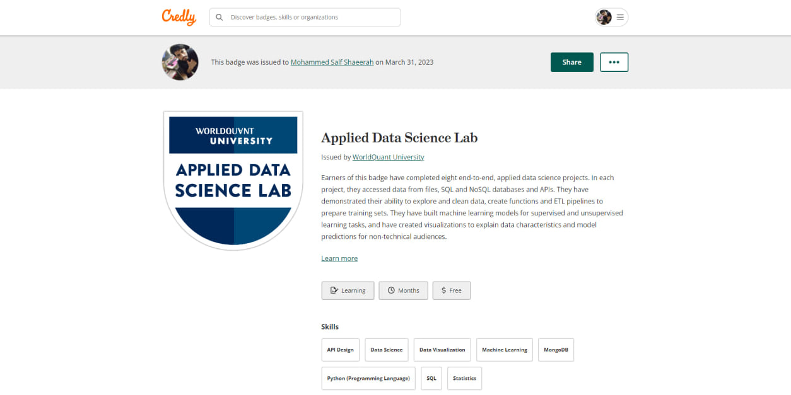
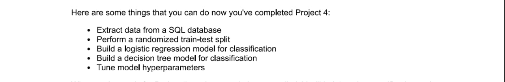
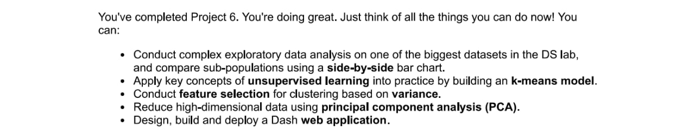

# **`An 8 end-to-end Data Science Projects With WQU`**

  <!--My-Projects-With-WQU-->
```mermaid
graph TD;
    My-Projects-With-WQU-->1-Housing-In-Mexico;
    My-Projects-With-WQU-->2-Apartment-Sales-In-Buenos-Aires;
    My-Projects-With-WQU-->3-Air-Quality-In-Nairobi;
    My-Projects-With-WQU-->4-Earthquake-Damage-In-Nepal;
    My-Projects-With-WQU-->5-Bankruptcy-In-Poland;
    My-Projects-With-WQU-->6-Customer-Segment-In-US;
    My-Projects-With-WQU-->7-A/B-Testing-At-WQU;
    My-Projects-With-WQU-->8-Volatility-Forecasting-In-India;
   ```
   
   
   



# **`Project 1. HOUSING IN MEXICO`**

A- A Brief About What You'll Do In Project 1 👇🏿


B- Core Skills Of Project 1 👇🏿


# **`Project 2. APARTMENT SALES IN BUENOS AIRES`**

A- A Brief About What You'll Do In Project 2 👇🏿


B- Core Skills Of Project 2 👇🏿


# **`Project 3. AIR QUALITY IN NAIROBI`**

A- A Brief About What You'll Do In Project 3 👇🏿


B- Core Skills Of Project 3 👇🏿


# **`Project 4. EARTHQUAKE DAMAGE IN NEPAL`**

A- A Brief About What You'll Do In Project 4 👇🏿


B- Core Skills Of Project 4 👇🏿


# **`Project 5. BANKRUPTCY IN POLAND`**

A- A Brief About What You'll Do In Project 5 👇🏿


B- Core Skills Of Project 5 👇🏿


# **`Project 6. CUSTOMER SEGMENTATION IN THE US`**

A- A Brief About What You'll Do In Project 6 👇🏿


B- Core Skills Of Project 6 👇🏿


# **`Project 7. A/B TESTING AT WORLDQUANT UNIVERSITY`**

A- A Brief About What You'll Do In Project 7 👇🏿


B- Core Skills Of Project 7 👇🏿


# **`Project 8. VOLATILITY FORECASTING IN INDIA`**

A- A Brief About What You'll Do In Project 8 👇🏿


B- Core Skills Of Project 8 👇🏿


# **`Link To My Credly-Badge`**

[My Credly Profile](https://www.credly.com/badges/7a905b0d-b71c-4f6c-a8e2-458983bd0257/public_url)

---


